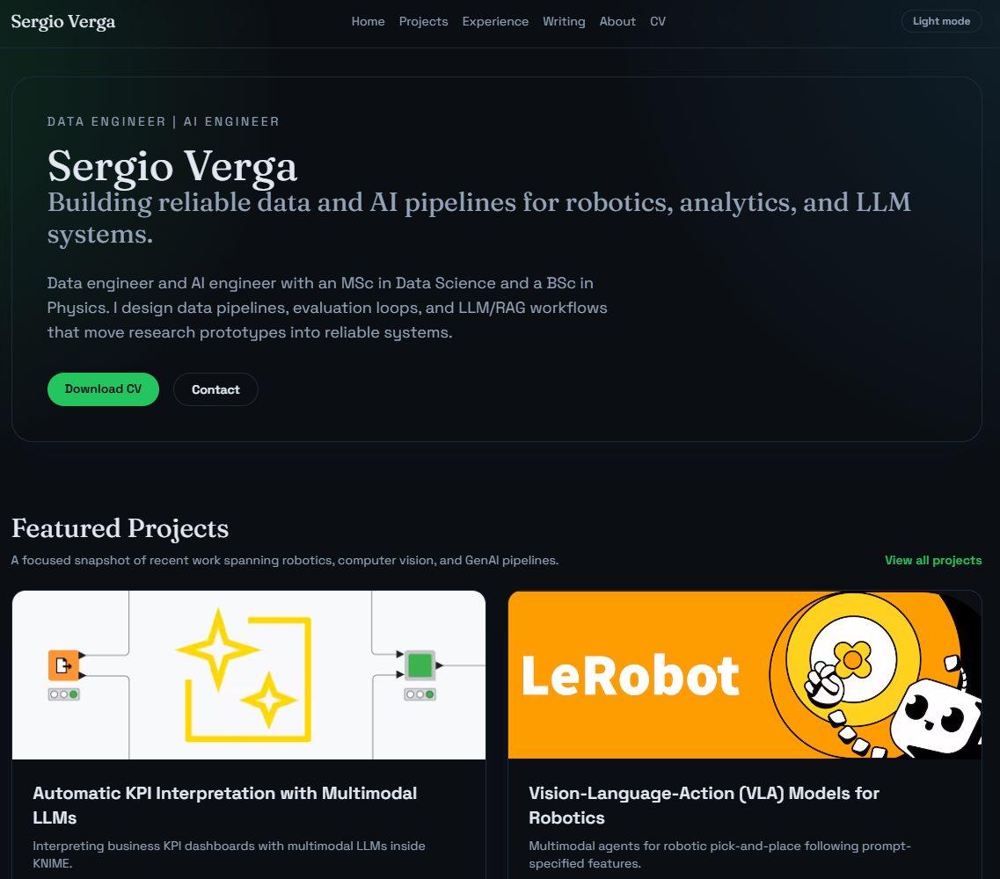

# Sergio Verga — AI-Themed Portfolio

Personal portfolio site built with **Next.js** (App Router), **TypeScript**, and **Tailwind CSS**, featuring a futuristic AI-inspired design with glassmorphism, violet/cyan gradients, and micro-animations.

<!-- Replace the path below with your own screenshot -->


## Design Highlights

- **Palette** — Electric violet `#8b5cf6` + cyan `#06b6d4` on a true-black base
- **Background** — Animated dot-grid pattern with floating gradient glow
- **Cards** — Glassmorphism surfaces with translucent blur and hover glow borders
- **Typography** — [Inter](https://fonts.google.com/specimen/Inter) body + [JetBrains Mono](https://fonts.google.com/specimen/JetBrains+Mono) headings
- **Animations** — Fade-in hero, pulsing navbar glow line, hover scale on project images
- **Dark / Light** — Full theme toggle support

## Local development

```bash
npm install
npm run dev
```

## Build

```bash
npm run build
npm run start
```

## Lint, typecheck, format

```bash
npm run lint
npm run typecheck
npm run format
```

## Content updates

- Site metadata and bio: `content/site.ts`
- Projects list: `content/projects.ts`
- Experience: `content/experience.ts`
- Education: `content/education.ts`
- Writing: `content/writing.ts`

Static assets live in `public/` and `public/images/`.

## Updating the README screenshot

Take a screenshot of the running site and save it as `image.png` in the project root:

```bash
npm run dev
# open http://localhost:3000 in your browser
# capture a full-page screenshot and save as image.png
```